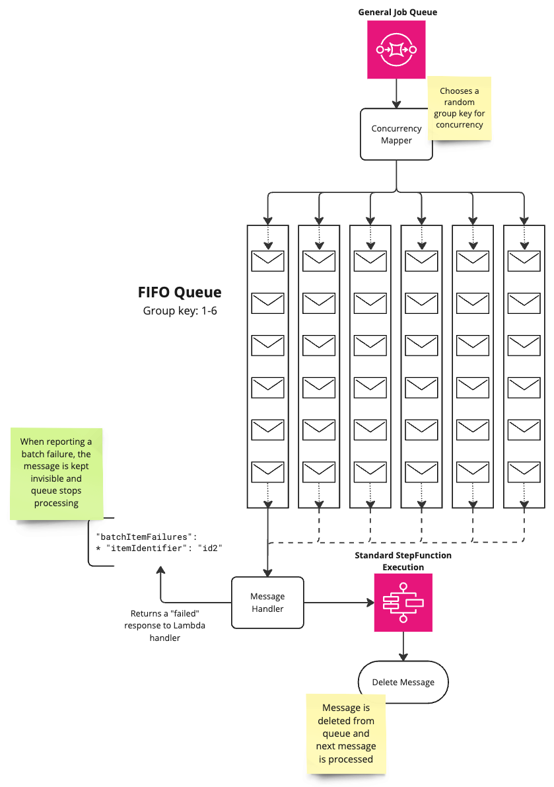

# Limiting StepFunction Concurrency with SQS FIFO

This repository contains a working example of the [Taming StepFunction’s Concurrency With SQS](#todo) blog post.

## Usage

1. Create a new CloudFormation stack and provide it with the `template.yml` file.
2. Invoke the `loader` Lambda function that the stack created.
3. Observe the following behavior:
   1. The StepFunction will start processing the messages from the SQS FIFO queue.
   2. The total count of executions in the StepFunction will stay around 200 (or a value you specified).
   3. The SQS FIFO queue will have a maximum of 200 (or a value you specified) messages in-flight at any given time.

The following diagram illustrates the architecture of the solution:

